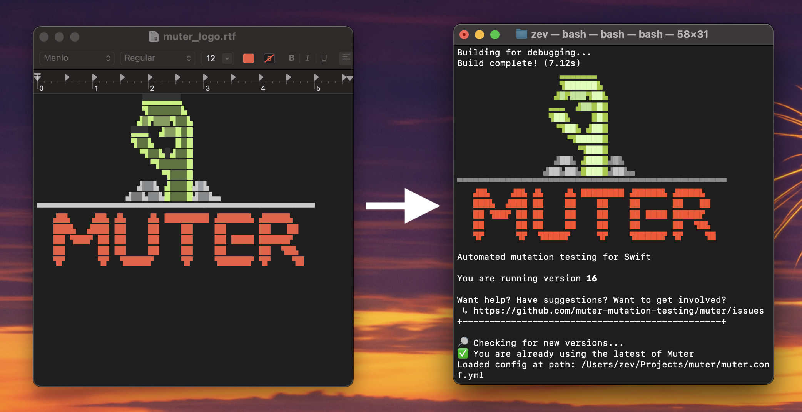

# Muter Logo Maker



Generate the Unicode art for the [muter](https://github.com/muter-mutation-testing/muter) logo. Use the included .rtf file to edit the logo Unicode art in TextEdit on macOS. Then run the script to render the chracters and colors from TextEdit into a Swift source file.

This is separate code from the main muter repo for two reasons:

1. So we don’t have to include an extra .rtf file and parsing code in the repo.
1. This repo uses an AppKit API to read the .rtf file as an `NSAttributedString`, and this API is not available on Linux, where muter needs to be able to run.

## Usage

Run MuterLogoMaker and pass in the path to the MuterLogo.swift file from the main muter repo. The file will be overwritten with the output of MuterLogoMaker.

```sh
swift run MuterLogoMaker --output /path/to/MuterLogo.swift
```

## Testing

To see if it worked, in the main muter repo, run `swift run` and look at the initial output. You can use Ctrl-C to cancel executation as soon as you see the logo.
